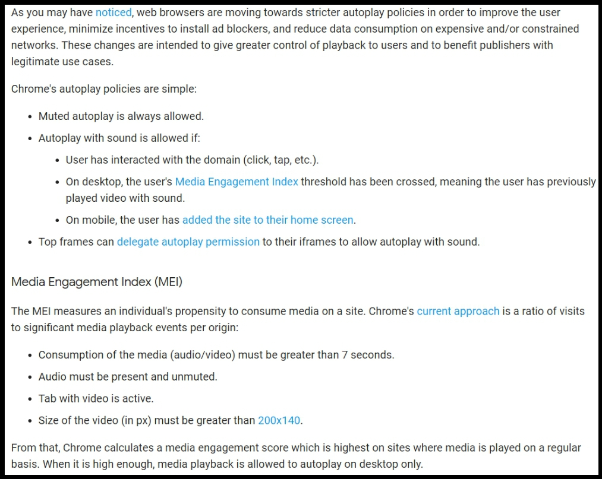
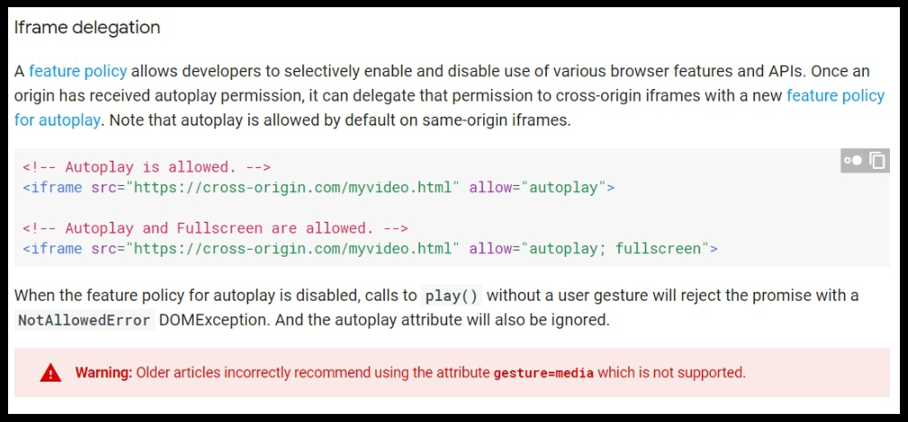

# Funny_JS

## 01.audio_autoplay_block_solution
> [Demo](https://ykliu0213.github.io/Funny_JS/01.audio_autoplay_block_solution/index.html)

* **個案動機：** 
  * 原本是想做一個像無名小站那樣，一開啟網頁就會自動播放背景音樂的功能，卻發現沒有辦法在 chrome 上成功執行QQ。去查了一下，發現真的是 chrome 瀏覽器的問題！從 2018 年 4 月開始， chrome 瀏覽器會在剛開啟網頁時阻擋 `<audio>` 的 `autoplay` 屬性，使得我們的音樂沒有辦法在開啟網頁時就自動播放。

* [**Chrome Autoplay Policy Changes**](https://developers.google.com/web/updates/2017/09/autoplay-policy-changes)  
  * 首先要先來解釋一下 chrome 為什麼做出這樣的改變，這是由於現在的網頁插入的（或是說外掛上來）的廣告太多了，對使用者來說除了影響體驗外，也會有額外的網路流量產生。因此，google希望幫使用者阻擋掉這些自動播放的廣告（還是出於善意的啦！才不是為了造成開發人員的困擾才這麼做的XD（誤））。

* **問題分析：** 
  * 一開始要先來看一下 chrome 阻擋的標準（下圖），我們可以從這邊瞭解到這些。
    * Chrome的自動播放政策很簡單，只要符合以下條件就允許播放：
      * 用戶已經和網頁互動（點擊）
      * 在電腦上，MEI指數達到某個標準，通常代表用戶在這之前已經有播放過帶有聲音的影片。
    * MEI指數 ── 使用者與網頁上媒體互動的程度 
      * 帶影片的標籤處於活動狀態

    

  * 在[文件](https://developers.google.com/web/updates/2017/09/autoplay-policy-changes)中也有提到（下圖），這次的 Policy 主要是針對 `<audio>` 和 `<video>` 兩個 `tag` ，並不會影響到 `<iframe>` ，因此我們可以從這裡下手。
  
    
  
* **解決方法：**
  * 瞭解問題出在哪後，我們就可以直接來解決它啦！根據前面的分析，`<iframe>` 不會受到 chrome 的阻擋，而網頁在播放帶有聲音的影片後，MEI指數就可以達標，MEI指數達標後，我們的 `<audio>` 就可以讓它 `autoplay` 了～

  * 首先，我們在 `<audio>` 之前塞一個 `<iframe>`， 這個 `<iframe>` 帶有一段安靜的短影片（0.25秒），那在網頁先行播放過這段影片後，這個網頁的MEI指數就能達標了，也因此我們的 `<audio>` 就可以順利的自動播放啦！

